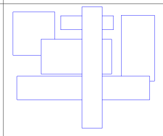

# 矩形组比较

在一个二维坐标系内，如何判断两个矩形的关系

    相等、包含、被包含、相交、不同

如果是两组矩形，又该怎么比较，怎么判断？ 

    两组矩形之间的比较，需要涉及到合并、拆分、比较等过程，整体复杂度还是比较高的。
    或许有简单高效的工具存在，可惜没找到，所以自己实现了一个。

坐标系内的一组矩形，大概是这个样子：

有什么用？

    图形比较，且不仅仅是图形。
    
    有些问题可以转换为一个二维关系，可以理解为一个矩形；
    很多个二维关系，可以认为是一组矩形；
    不同场景之间是什么关系，就是两个矩形组的比较。
    
